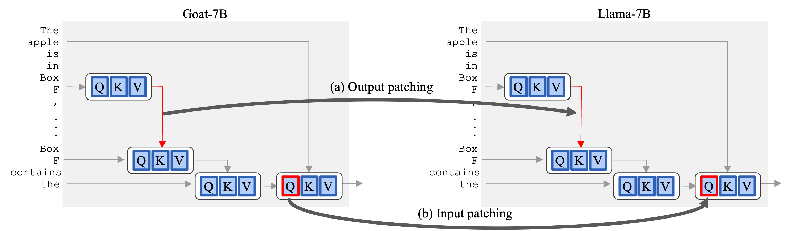

This repository contains the code used for the experiments in the paper [Fine-Tuning Enhances Existing Mechanisms: A Case Study on Entity Tracking]().

We study how fine-tuning affects the internal mechanisms implemented in language models. As a case study, we explore the property of entity tracking in Llama-7B, and in its fine-tuned variants - Goat-7B and Vicuna-7B.

Our findings suggest that fine-tuning enhances, rather than fundamentally alters, the mechanistic operation of the model.

## CMAP
A new approach for patching activations across models to reveal improved mechanisms.
Our implementation is based on [baukit/nethook.py](baukit/nethook.py), however, it can easily be adapted to any other patching package.
[experiment_3/cmap.ipynb](experiment_3/cmap.ipynb) demonstrare how to run the full experiment.

<p align="center">

</p>

## Setup

To get all the dependencies run:
```bash
conda env create -f environment.yaml
```
## How to cite
