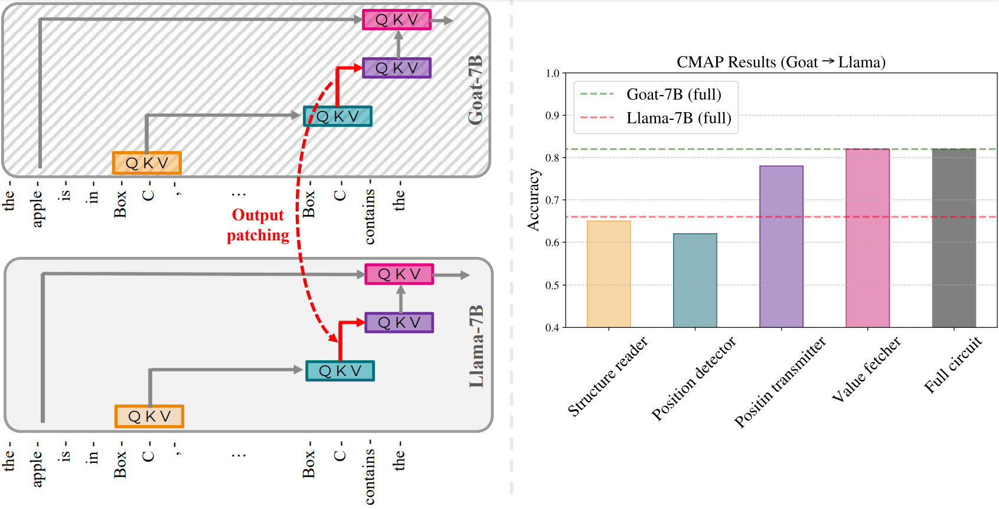

## Fine-Tuning Enhances Existing Mechanisms: A Case Study on Entity Tracking

This repository contains the code used for the experiments in the paper [Fine-Tuning Enhances Existing Mechanisms: A Case Study on Entity Tracking](https://openreview.net/forum?id=8sKcAWOf2D). *Note: You need to have the weights for the LLaMA-7b model which is under a non-commercial license. Use [this form](https://docs.google.com/forms/d/e/1FAIpQLSfqNECQnMkycAp2jP4Z9TFX0cGR4uf7b_fBxjY_OjhJILlKGA/viewform?usp=send_form) to request access to the model, if you do not have it already.*

We study how fine-tuning affects the internal mechanisms implemented in language models. As a case study, we explore the task of entity tracking in Llama-7B, and in its fine-tuned variants - Vicuna-7B, Goat-7B, Float-7B.

<p align="center">

</p>

**Our findings suggest that fine-tuning enhances, rather than fundamentally alters, the mechanistic operation of the model.**

Please check [finetuning.baulab.info](finetuning.baulab.info) for more information.

## Methods
In order to discover the underlying mechanism for performing entity tracking task, we employed: 1) [Path Patching](https://arxiv.org/abs/2211.00593) ([experiment_1/path_patching.py](experiment_1/path_patching.py)) and 2) [Desiderata-based Component Masking](https://arxiv.org/abs/2307.03637) ([experiment_2/DCM.py](experiment_2/DCM.py)). Both the methods are implemented using [baukit](baukit/nethook.py), which can be easily adopted for other tasks.


Moreover, in order to uncover the reason behind the performance enhancement in fine-tuned models employing the same mechanism, we have introduced a novel approach called CMAP (Cross-Model Activation Patching). This method involves patching activations across models to elucidate the enhanced mechanisms. The notebook [experiment_3/cmap.ipynb](experiment_3/cmap.ipynb) provides a demonstration on how to execute the complete experiment.

<p align="center">

</p>

## Setup

To get all the dependencies run:
```bash
conda env create -f environment.yml
conda activate finetuning
```
## How to cite
